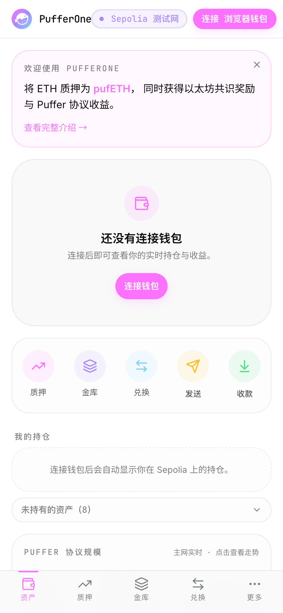
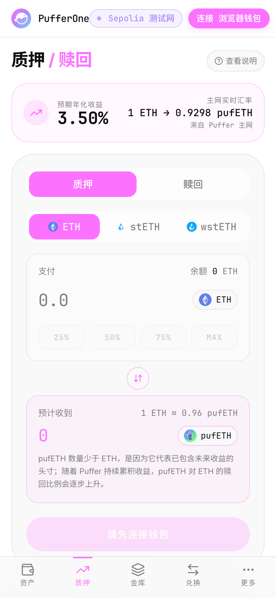
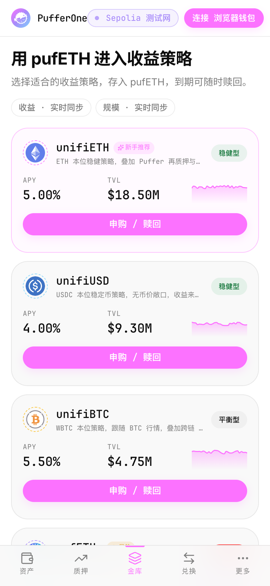
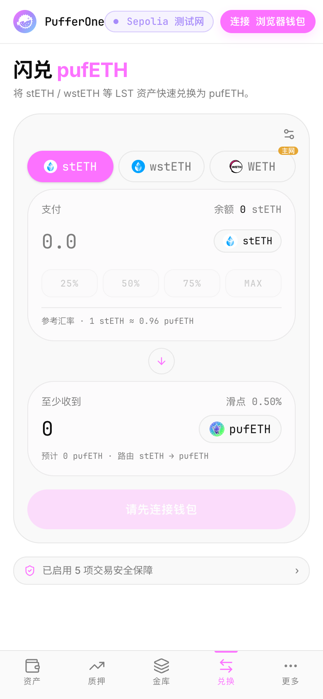
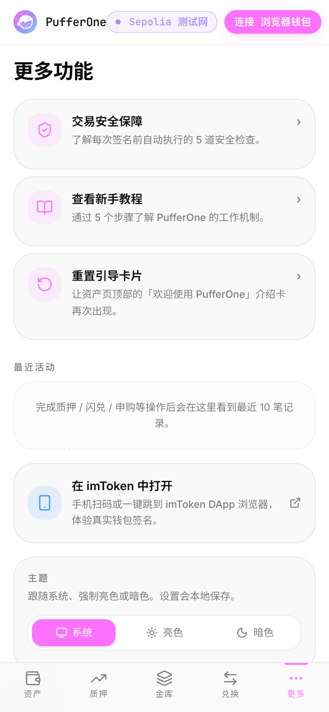
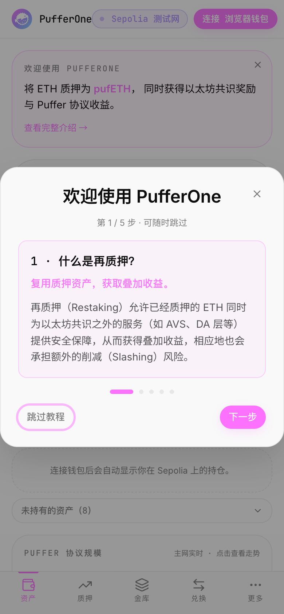

<div align="center">
  

  <h1>PufferOne</h1>

  <p><strong>再质押，更简单。</strong></p>
  <p>手机优先的 Puffer Finance 接入终端 — 让流动再质押像用钱包一样自然。</p>

  <p>
    <a href="https://beautifulrem.github.io/pufferone/">在线体验</a> ·
    <a href="#-快速开始">快速开始</a> ·
    <a href="#-安全模型">安全模型</a>
  </p>

  <p>
    
    
    
    
  </p>
</div>

---

## 核心功能

- **三币种铸造 pufETH** — ETH / stETH / wstETH，对齐 Puffer 官方 EigenLayer Restaking 通道
- **4 个 UniFi 金库** — unifiETH / unifiUSD / unifiBTC / pufETHs，链上存入与赎回
- **一键闪兑** — stETH / wstETH / WETH → pufETH，链上滑点保护
- **资产管理** — 持仓总览、协议规模看板、收款 / 发送、历史折线图
- **5 道签前安全保障** — 交易模拟 · 风险分级 · 精确授权 · 签前摘要 · 合约地址可见
- **新手引导** — 首次访问 5 步教学，3 分钟了解再质押
- **三档主题** — 跟随系统 / 亮色 / 暗色

## 📸 截图

<div align="center">
  <table>
    <tr>
      <td align="center"><br><sub>资产总览</sub></td>
      <td align="center"><br><sub>质押</sub></td>
      <td align="center"><br><sub>金库</sub></td>
    </tr>
    <tr>
      <td align="center"><br><sub>闪兑</sub></td>
      <td align="center"><br><sub>更多</sub></td>
      <td align="center"><br><sub>新手引导</sub></td>
    </tr>
  </table>
</div>

## ⚡ 快速开始

```bash
git clone https://github.com/beautifulrem/pufferone.git
cd pufferone
pnpm install
pnpm dev
# → http://localhost:5173
```

### 合约（可选）

Sepolia 上已部署一套 mock 合约可直接使用。自行部署：

```bash
cd contracts
cp .env.example .env  # 填入 PRIVATE_KEY（不要提交）
forge build && forge test
forge script script/Deploy.s.sol --rpc-url $SEPOLIA_RPC_URL --broadcast
```

## 🌐 已部署合约（Sepolia）

| 合约 | 地址 |
|---|---|
| MockPufETH | [`0xd44387034102491Af58292fF1c7405AED4e7Eb04`](https://sepolia.etherscan.io/address/0xd44387034102491Af58292fF1c7405AED4e7Eb04) |
| MockStETH | [`0xB59271CD9158Bb50125c3F9AC5CA013eE2fa7AF6`](https://sepolia.etherscan.io/address/0xB59271CD9158Bb50125c3F9AC5CA013eE2fa7AF6) |
| MockWstETH | [`0x0353908C9a9b58108E7A6446619B567A9207336D`](https://sepolia.etherscan.io/address/0x0353908C9a9b58108E7A6446619B567A9207336D) |
| MockPufferDepositor | [`0x8628C68227EAfe1B435eb3F918e5358aE5b1c390`](https://sepolia.etherscan.io/address/0x8628C68227EAfe1B435eb3F918e5358aE5b1c390) |
| MockSwapRouter | [`0xF69507F745dC5b4a92f34c824A06e5308578361a`](https://sepolia.etherscan.io/address/0xF69507F745dC5b4a92f34c824A06e5308578361a) |
| MockEthUnstake | [`0x24842fcD8c000d23F5e19BB3dFdda4a764802D11`](https://sepolia.etherscan.io/address/0x24842fcD8c000d23F5e19BB3dFdda4a764802D11) |
| unifiETH Vault | [`0x4D42919570c9dF3356afa44A0236198168933CCD`](https://sepolia.etherscan.io/address/0x4D42919570c9dF3356afa44A0236198168933CCD) |
| unifiUSD Vault | [`0x4C0234A302650E5B56A5D658A037143f6B72948f`](https://sepolia.etherscan.io/address/0x4C0234A302650E5B56A5D658A037143f6B72948f) |
| unifiBTC Vault | [`0xEae62881Bbeeb18bDAE3a9C5edAB4B7eF33128e4`](https://sepolia.etherscan.io/address/0xEae62881Bbeeb18bDAE3a9C5edAB4B7eF33128e4) |
| pufETHs Vault | [`0xE8EAB43253f09C674B49b39451Bd3647cB21AeEb`](https://sepolia.etherscan.io/address/0xE8EAB43253f09C674B49b39451Bd3647cB21AeEb) |

## 🔒 安全模型

- **永不接触秘密** — 私钥、助记词、密码全部留在用户钱包；本应用不读、不存、不传
- **所有签名由钱包完成** — 通过 EIP-1193 / WalletConnect 标准接口
- **签前必模拟** — `simulateContract` 失败即拦截
- **精确数额授权** — 杜绝无限授权
- **测试网先行** — 当前部署在 Sepolia，无真实资产风险

## 📄 License

[MIT](./LICENSE)
